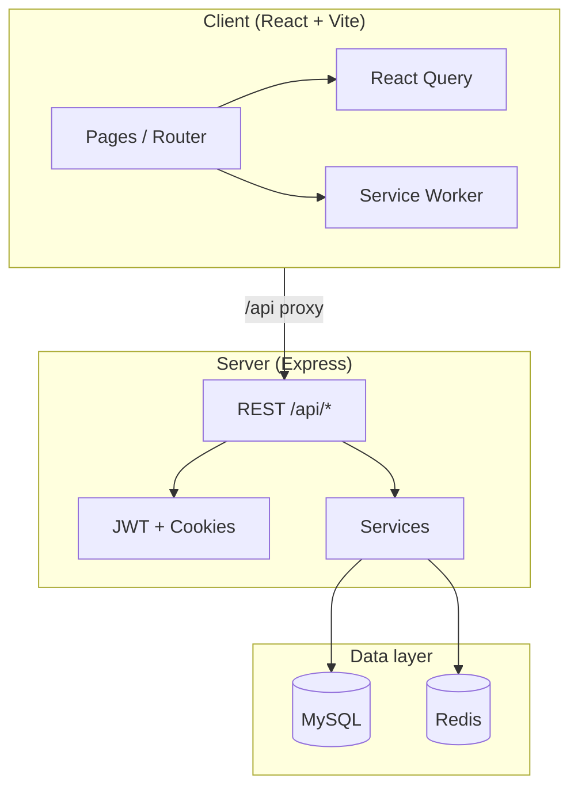
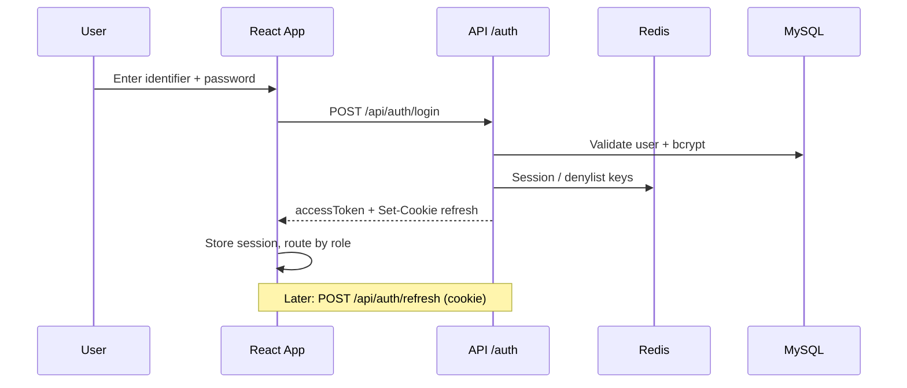
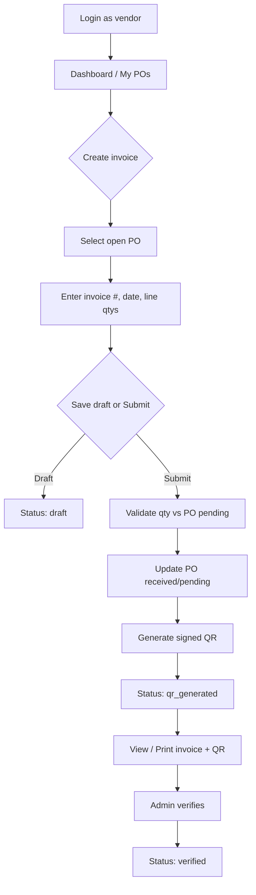
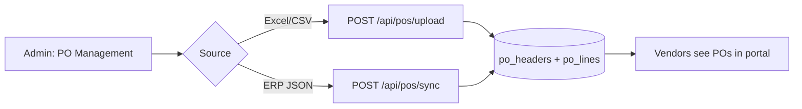
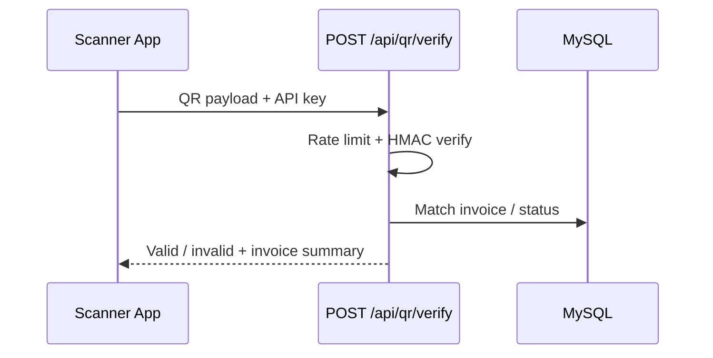

# Vendor QR Code Management System — Project Guide

A full-stack **Vendor QR Code Based Invoice Management System**: vendors create invoices against purchase orders (POs), submit them, receive a **signed QR code**, and admins verify invoices and manage master data. The stack is **React (Vite)** + **Express (Node)** + **MySQL** + **Redis** (sessions, cache, rate limits).

---

## What the system does

| Role | Main capabilities |
|------|-------------------|
| **Vendor** | Login → view POs → create invoice (draft) → submit → QR generated → print invoice → track status |
| **Admin / Superadmin** | Dashboard, vendors, PO sync/upload, invoice verify/reject, plants/materials/storage masters, audit logs |
| **External scanner** | `POST /api/qr/verify` (API key) to validate QR payload |

**Invoice lifecycle:** `draft` → `submitted` → `qr_generated` → `verified` or `rejected`

---

## Prerequisites

| Software | Purpose |
|----------|---------|
| **Node.js** 18+ | Client & server |
| **MySQL** 8+ | Primary database |
| **Redis** 6+ | Sessions, OTP, caching, optional Bull queue |
| **npm** | Dependencies |

Optional: SMTP (welcome/reset emails), Redis for production-scale features.

---

## Setup (first time)

### 1. Database

Run the schema (creates DB `vendor_qr_invoice` by default):

```bash
mysql -u root -p < Server/config/schema.sql
```

Apply migrations if present:

```bash
mysql -u root -p vendor_qr_invoice < Server/config/migrations/002_invoice_system_id.sql
```

**Important:** `Server/.env.example` uses `DB_NAME=vendor_qr_invoice`, while `schema.sql` creates `vendor_qr_invoice`. If your `.env` uses a different name (e.g. `vendorqr`), either align `DB_NAME` with the schema or run the schema against your chosen database name.

**phpMyAdmin / MySQL #3823 on `users` table:** If import fails with *Column 'vendor_code' cannot be used in a check constraint ... referential action*, use the current `schema.sql` (FK uses `ON UPDATE RESTRICT` on `users.vendor_code`). Drop the partial database and import again:

```sql
DROP DATABASE IF EXISTS vendor_qr_invoice;
```

Then re-import `Server/config/schema.sql` once.

**MySQL #3814 on `invoices`:** `CHECK (invoice_date <= CURDATE())` is not allowed (non-deterministic function). The schema omits that CHECK; the API validates invoice dates on create/submit.

### 2. Server environment

```bash
cd Server
copy .env.example .env   # Windows
# cp .env.example .env   # macOS/Linux
```

Edit `Server/.env` at minimum:

- `DB_HOST`, `DB_USER`, `DB_PASSWORD`, `DB_NAME`
- `JWT_ACCESS_SECRET`, `JWT_REFRESH_SECRET` (long random strings)
- `QR_SECRET_KEY`, `QR_VERIFY_API_KEY`
- `REDIS_HOST`, `REDIS_PORT` (Redis must be running for auth/OTP)

See `Server/.env.example` for all options (cache TTLs, Bull queue, SMTP, cluster, etc.).

### 3. Install & run backend

```bash
cd Server
npm install
npm run dev
```

- API: **http://localhost:5000**
- Health: `GET http://localhost:5000/api/health`

### 4. Client

```bash
cd Client
npm install
npm run dev
```

- UI: **http://localhost:5173**
- Vite proxies `/api` → `http://localhost:5000`

### 5. Production build (optional)

```bash
cd Client
npm run build
npm run preview
```

```bash
cd Server
npm start
```

Set `CLIENT_URL` and `NODE_ENV=production` in server `.env`.

---

## Login credentials

**The repository does not ship default portal users.** `schema.sql` only notes that a superadmin must be created with a bcrypt hash — no emails or passwords are committed.

You must create users yourself.

### A. Bootstrap first admin (recommended for dev)

1. Generate a bcrypt hash (password must meet policy: 8+ chars, uppercase, digit, special):

```bash
cd Server
node -e "import bcrypt from 'bcrypt'; console.log(await bcrypt.hash('Admin@123', 12));"
```

2. Insert a superadmin (no `vendor_code`):

```sql
USE vendor_qr_invoice;  -- or your DB_NAME

INSERT INTO users (email, password_hash, role, status)
VALUES (
  'admin@example.com',
  '<paste-bcrypt-hash-here>',
  'superadmin',
  'active'
);
```

3. Log in at http://localhost:5173/login with:
   - **Identifier:** `admin@example.com` (vendors may use vendor code or email)
   - **Password:** whatever you hashed (e.g. `Admin@123`)

### B. Vendor user (after admin exists)

1. Admin creates **vendor** in **Admin → Vendors**.
2. Admin creates portal user via **POST /api/auth/register** (admin-only) or user management — password can be auto-generated and emailed if SMTP is configured.
3. Vendor logs in with **vendor code or email** + password.

### C. Sample PO (admin testing)

`POManagementPage` includes sample JSON for manual sync (`PO-TEST-001`, vendor `V001`) — only works if that vendor and master data exist.

---

## How login works

- **Identifier:** vendor code **or** email (`POST /api/auth/login`)
- **Tokens:** JWT access token (memory) + refresh token (httpOnly cookie)
- **Roles:** `vendor` → vendor UI; `admin` / `superadmin` → `/admin/*`
- **Forgot password:** OTP in Redis + email (needs SMTP)

**Password policy:** min 8 characters, one uppercase, one digit, one special character.

---

## Architecture (high level)



---

## Application flows

### Authentication flow



### Vendor invoice flow



### Admin PO sync flow



### QR verification (company scanner)



---

## Main routes (frontend)

| Path | Who | Purpose |
|------|-----|---------|
| `/login` | Public | Sign in |
| `/forgot-password` | Public | Password reset OTP |
| `/dashboard` | Vendor | Summary |
| `/pos`, `/pos/:poNumber` | Vendor | PO list & detail |
| `/invoices`, `/invoices/create` | Vendor | List & wizard |
| `/invoices/:id`, `/invoices/:id/print` | Vendor | Detail & print |
| `/profile` | Vendor | Profile (read-only) |
| `/admin/dashboard` | Admin | Metrics |
| `/admin/vendors` | Admin | Vendor CRUD |
| `/admin/pos` | Admin | PO upload/sync |
| `/admin/invoices` | Admin | Verify/reject |
| `/admin/masters` | Admin | Plants, materials, storage |
| `/admin/audit-logs` | Admin | Audit trail |

---

## Main API groups (backend)

| Prefix | Examples |
|--------|----------|
| `/api/health` | Health check |
| `/api/auth` | login, refresh, logout, forgot/reset password, register (admin) |
| `/api/vendors` | Vendor CRUD (admin) |
| `/api/users` | User management (admin) |
| `/api/pos` | List POs, sync, upload |
| `/api/invoices` | CRUD, submit, status |
| `/api/qr` | Image, verify, regenerate |
| `/api/masters` | Plants, materials, storage |
| `/api/admin` | Dashboard, audit logs |

---

## Project layout

```
Vendor QR Code Management System/
├── Client/                 # React UI (Vite, Tailwind, React Query)
│   ├── src/
│   │   ├── pages/          # vendor, admin, auth
│   │   ├── hooks/queries/  # React Query hooks
│   │   ├── router/         # AppRouter, protected routes
│   │   └── lib/            # queryClient, webVitals, SW registration
│   └── public/
│       ├── sw.js           # Service worker (Workbox CDN)
│       └── offline.html
├── Server/                 # Express API
│   ├── server.js           # entry, optional cluster
│   ├── app.js              # middleware + routes
│   ├── config/             # db.js, redis.js, schema.sql
│   ├── services/           # business logic
│   ├── routes/
│   ├── controllers/
│   ├── middleware/
│   └── queues/             # invoice submit (Bull, optional)
└── PROJECT_GUIDE.md        # this file
```

---

## Redis with Docker (local dev)

1. **Start Docker Desktop** and wait until it is running.
2. From the project root:

```powershell
cd "D:\Vendor QR Code Management System"
docker compose up -d
```

3. Verify:

```powershell
docker compose ps
docker exec vendor-qr-redis redis-cli ping
```

Expected: `PONG`. Your `Server/.env` should already have `REDIS_HOST=127.0.0.1` and `REDIS_PORT=6379`.

4. Start the API — you should see `[redis] Connected` in the terminal.

**Stop Redis:** `docker compose down`  
**Stop but keep data:** `docker compose stop`

Config file: [docker-compose.yml](docker-compose.yml) (service name `redis`, container `vendor-qr-redis`).

---

## Production deployment (VPS)

Full step-by-step guide: **[DEPLOY.md](DEPLOY.md)**

Quick start on a Linux server:

```bash
cp deploy/env/compose.env.example .env
cp deploy/env/api.env.example deploy/env/api.env
# Edit .env — domains, JWT secrets, ENCRYPTION_KEY, DB/Redis passwords
./deploy/scripts/deploy.sh
```

Architecture: `www.pinwardbarcode.in` → SPA, `api.pinwardbarcode.in` → API, via nginx gateway + optional Caddy for HTTPS.

---

## Day-to-day commands

| Task | Command |
|------|---------|
| Start Redis (Docker) | `docker compose up -d` (project root) |
| Dev API | `cd Server && npm run dev` |
| Dev UI | `cd Client && npm run dev` |
| Build UI | `cd Client && npm run build` |
| Bundle report | `cd Client && npm run analyze` |
| Start API (prod) | `cd Server && npm start` |

---

## Optional / production features

- **Redis:** Sessions, OTP, rate limits, cache-aside for PO lists and QR images.
- **Bull queue:** Set `INVOICE_QUEUE_ENABLED=true` for async invoice submit (202 + poll).
- **Cluster:** `CLUSTER_ENABLED=true` in production (`server.js`).
- **Client env:** `VITE_MONITORING_URL` (web vitals), `VITE_COMPANY_LOGO_URL` (logo srcset).
- **Service worker:** Caches master data and static assets; does not cache invoice/PO API responses.

---

## Quick checklist for a working demo

1. MySQL schema applied; `DB_NAME` in `.env` matches the database you created.
2. Redis running on `127.0.0.1:6379`.
3. JWT and QR secrets set in `Server/.env`.
4. First **superadmin** inserted (see Login credentials).
5. Create vendor + vendor user; sync or upload a PO.
6. Vendor: create invoice → submit → print with QR.
7. Admin: verify invoice in **Admin → Invoices**.

---

## Tech stack summary

| Layer | Technologies |
|-------|----------------|
| Frontend | React 19, Vite 8, React Router 7, TanStack Query, TanStack Virtual, Tailwind 4, Recharts, web-vitals |
| Backend | Express 5, MySQL2, Redis (ioredis), JWT, bcrypt, Bull (optional), Winston, Zod |
| Security | Helmet, rate limits, ETag, gzip, signed QR (HMAC), role-based access |

---

*Last updated: local development, Redis, and production deployment (see DEPLOY.md).*
