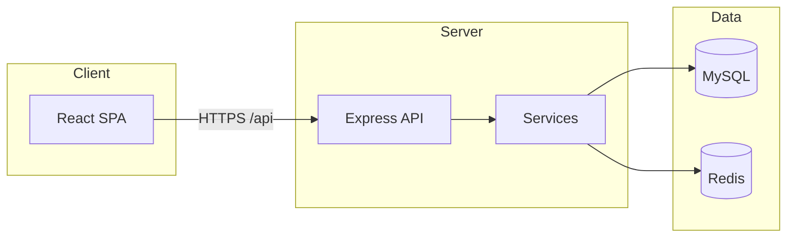

# Vendor QR Code Management System

[](https://www.erpdigitalbarcode.in/login)
[](https://nodejs.org/)
[](https://react.dev/)
[](https://www.mysql.com/)
[](https://redis.io/)
[](https://www.docker.com/)

Enterprise **vendor invoice portal** with **PO-linked validation**, **encrypted QR codes** for gate verification, and a full **admin console** for vendors, purchase orders, and invoice lifecycle management.

---

## Live application

| Link | Description |
|------|-------------|
| **[Sign in → erpdigitalbarcode.in](https://www.erpdigitalbarcode.in/login)** | Vendor & admin portal |
| [www.erpdigitalbarcode.in](https://www.erpdigitalbarcode.in) | Web application |
| [api.erpdigitalbarcode.in/api/health](https://api.erpdigitalbarcode.in/api/health) | API health endpoint |

> Portal access is **invitation-only**. Vendors and administrators receive credentials from the system admin. There are no public demo accounts in this repository.

---

## Table of contents

- [About](#about)
- [Features](#features)
- [Architecture](#architecture)
- [Tech stack](#tech-stack)
- [Getting started](#getting-started)
- [Production deployment](#production-deployment)
- [API reference](#api-reference)
- [Documentation](#documentation)
- [Security notes](#security-notes)
- [License](#license)

---

## About

This project digitizes the vendor invoicing workflow for manufacturing supply chains:

1. **Admins** onboard vendors, sync or upload POs (including SAP Excel), and manage master data.
2. **Vendors** log in, pick an open PO, build an invoice, and submit quantities against line balance.
3. The system **validates** PO limits, records dispatch history, and generates a **cryptographically secured QR code** on the printable invoice.
4. **Gate / GRN scanners** verify invoices via a dedicated API using an API key.

**Invoice status flow**

```
draft → submitted → qr_generated → verified | rejected
```

Built for [Paranjape Autocast Pvt. Ltd.](https://www.erpdigitalbarcode.in) and deployed at **erpdigitalbarcode.in**.

---

## Features

### Vendor portal

- Login with vendor code or email + password  
- Browse open POs with balance / pending quantity per line  
- 3-step invoice wizard: **Select PO → Details → Review & Submit**  
- Partial deliveries and append quantities to existing invoices  
- Print invoice with QR code  
- Real-time invoice status tracking  

### Admin console

- Dashboard with KPIs and charts  
- Vendor & user management  
- PO manual sync and **SAP Excel bulk upload**  
- Invoice verify / reject / admin generate  
- PO balance & material balance reports (Excel export)  
- Plants, materials, storage location masters  
- Audit logs and PO sync history  

### Security & integrations

- JWT + httpOnly refresh cookies  
- bcrypt passwords, lockout, OTP password reset (SMTP)  
- Rate limiting on authentication  
- AES-256-GCM encrypted QR payloads  
- `POST /api/qr/verify` for external scanner integration  
- Immutable audit trail  

---

## Architecture



**Production layout:** Docker Compose (`mysql`, `redis`, `api`, `web`, `gateway`) behind host **nginx** with **Let's Encrypt** TLS on `www` and `api` subdomains.

---

## Tech stack

| Layer | Technologies |
|-------|----------------|
| Frontend | React 19, Vite, React Router, TanStack Query, React Hook Form, Zod, Recharts |
| Backend | Node.js, Express 5, JWT, bcrypt, Winston, Bull (optional) |
| Data | MySQL 8.4, Redis 7 |
| QR / crypto | qrcode, AES-256-GCM, HMAC signing |
| DevOps | Docker, Docker Compose, nginx, GitHub Actions CI |

---

## Getting started

### Prerequisites

- **Node.js** 18+  
- **MySQL** 8+  
- **Redis** 6+  

### Clone and install

```bash
git clone https://github.com/YOUR_USERNAME/Vendor-QR-Code-Management-System.git
cd Vendor-QR-Code-Management-System
```

### Database

```bash
mysql -u root -p < Server/config/schema.sql
node Server/migrations/run_migration.js
```

### Backend

```bash
cd Server
cp .env.example .env
# Configure DB_*, JWT_*, REDIS_*, ENCRYPTION_KEY (64-char hex), QR_* keys
npm install
npm run dev
```

- API: `http://localhost:5000`  
- Health: `GET http://localhost:5000/api/health`  

### Frontend

```bash
cd Client
npm install
npm run dev
```

- UI: `http://localhost:5173`  
- Vite dev server proxies `/api` → `http://localhost:5000`  

### Bootstrap first admin

No default users are included. Generate a bcrypt hash and insert a superadmin — full steps in [PROJECT_GUIDE.md](PROJECT_GUIDE.md#login-credentials).

---

## Production deployment

Deploy with Docker on any Linux VPS (tested on Hostinger + GoDaddy DNS):

```bash
cp deploy/env/compose.env.example .env
cp deploy/env/api.env.example deploy/env/api.env
# Set domains, secrets, and VITE_* branding — never commit .env

docker compose -f docker-compose.prod.yml --env-file .env up -d --build
```

Configure DNS **A records** for `@`, `www`, and `api` → your VPS IP, then terminate TLS with **Certbot + nginx** on ports 80/443.

| Variable | Example (production) |
|----------|----------------------|
| `FRONTEND_DOMAIN` | `www.erpdigitalbarcode.in erpdigitalbarcode.in` |
| `API_DOMAIN` | `api.erpdigitalbarcode.in` |
| `VITE_API_URL` | `https://api.erpdigitalbarcode.in` |
| `ENCRYPTION_KEY` | 64-character hex (`openssl rand -hex 32`) |

See [DEPLOY.md](DEPLOY.md) and [deploy/DOMAIN-erpdigitalbarcode.in.md](deploy/DOMAIN-erpdigitalbarcode.in.md).

---

## API reference

| Module | Path | Description |
|--------|------|-------------|
| Auth | `/api/auth` | Login, refresh, logout, register, password reset |
| POs | `/api/pos` | Vendor PO list, admin Excel upload |
| Invoices | `/api/invoices` | Draft, persist, submit, print data |
| QR | `/api/qr` | Generate & verify (API key) |
| Admin | `/api/admin` | Dashboard, vendors, invoices, audit |
| Masters | `/api/masters` | Plants, materials, storage |
| Health | `/api/health` | Liveness + DB/Redis/disk checks |

---

## Documentation

| File | Contents |
|------|----------|
| [PROJECT_GUIDE.md](PROJECT_GUIDE.md) | Architecture, auth flows, local setup |
| [DEPLOY.md](DEPLOY.md) | Docker production guide |
| [deploy/DOMAIN-erpdigitalbarcode.in.md](deploy/DOMAIN-erpdigitalbarcode.in.md) | DNS & domain checklist |

---

## Security notes

- **Never commit** `.env`, `deploy/env/api.env`, or real secrets to GitHub.  
- Use `deploy/env/*.example` as templates only.  
- Rotate `JWT_*`, `ENCRYPTION_KEY`, and database passwords if they were ever exposed.  
- Production requires HTTPS on both `www` and `api` hosts for secure cookies (`COOKIE_SECURE=true`).  

---

## License

Copyright © 2026 Paranjape Autocast Pvt. Ltd.

This repository is **public for portfolio and reference**. Source code is provided as-is. Commercial use, redistribution, or deployment without permission from the copyright holder is not permitted unless a separate license is granted.

For portal access or licensing inquiries, use the [live application](https://www.erpdigitalbarcode.in/login) contact channels or reach out to the repository maintainer.

---

<p align="center">
  <a href="https://www.erpdigitalbarcode.in/login"><strong>Open Vendor QR Portal →</strong></a>
</p>
